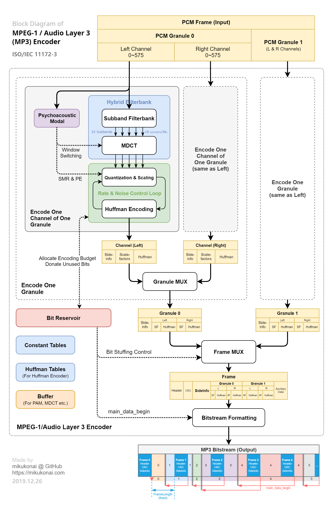
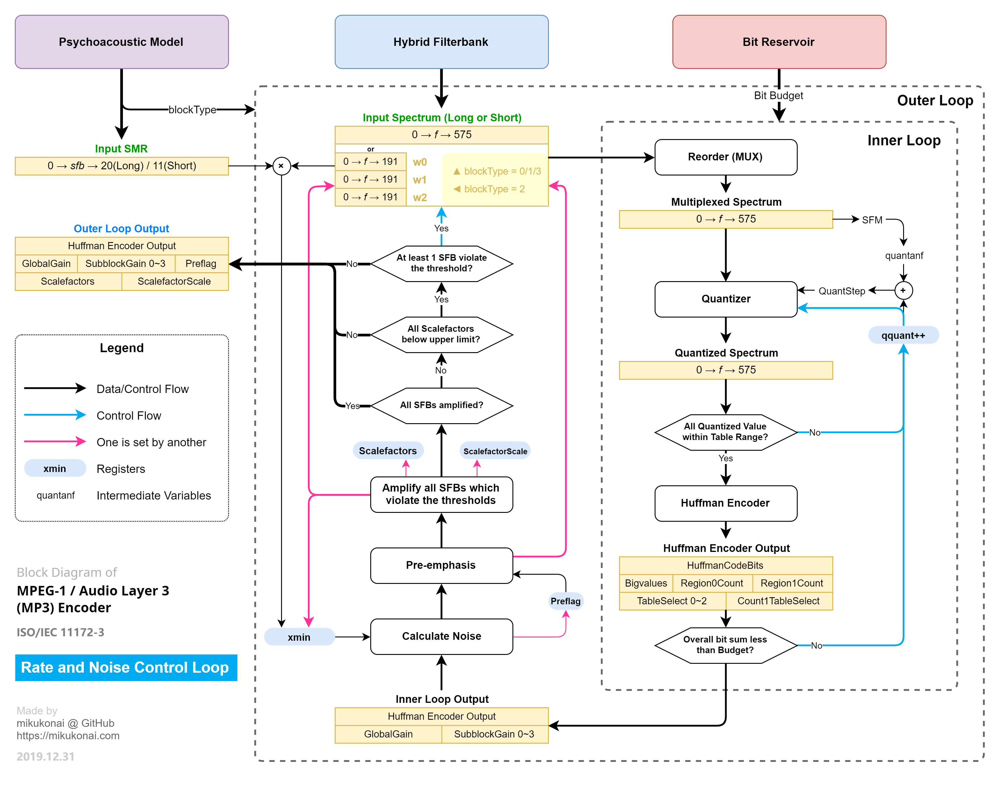
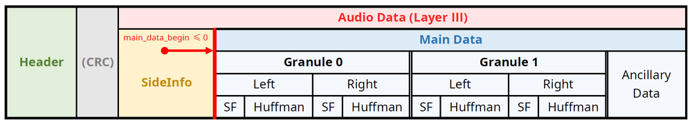

------

MPEG-1 Audio Layer 3 (MP3) 音频编码器。仅供个人学习研究，不宜用于正式的编码工作。正式编码务必使用LAME等成熟的编码器。

[可视化演示](https://mikukonai.com/Aqua/index.html)

## 特性规划

正在开发的特性：

- 第二心理声学模型

暂不实现的特性：

- 联合立体声
- 混合块
- 尺度因子预测（即scfsi）
- 低采样率支持（MPEG-2标准）
- VBR（非标准）
- ID3标签（非标准）
- 回放增益（非标准）

## 开发进度

|日期|进展|
|:----|:----|
|2019.11.01|项目启动，开始资料调研工作|
|2019.11.07|建立仓库“Otonashi”|
|2019.11.09|实现WAV解析、播放和频谱显示|
|2019.11.14|实现低通滤波（支线工作）|
|2019.11.16|初步实现分析子带滤波器|
|2019.11.21|开始开发第二心理声学模型|
|2019.11.23|分析子带滤波器可视化|
|2019.11.27|实现MDCT和长块去混叠|
|2019.11.29|开始开发内/外层循环和哈夫曼编解码|
|2019.12.04|切换到新仓库，并更名为“MP3-Study”|
|2019.12.24|实现比特储备机制|
|2020.01.05|实现比特流组装|
|2020.01.07|输出第一个合式MP3文件|
|**2020.01.15**|修正若干重大错误，尝试编码若干个完整的音乐文件，效果不错|
|2020.01.19|项目定名“Aquarius”并设计图标|
|2020.05.23|项目更名“Aqua”|
|进行中|实现第二心理声学模型和高频预加重|
|进行中|完善项目文档；处理掉所有TODO|
|进行中|完成以上工作后，发布第一个基线版本（V0.1.0）|

## 可视化

- [MDCT所使用的4种窗口及其转换](https://mikukonai.com/Aqua/demo/MDCT-windows.html)
- [低通滤波](https://mikukonai.com/Aqua/demo/LPF.html)（支线任务）
- [分析子带滤波器组](https://mikukonai.com/Aqua/demo/Filterbank.html)

## 研究笔记

- [分析子带滤波器组](./documentation/分析子带滤波器组.md)
- [心理声学模型](./documentation/心理声学模型.md)
- [发表在博客上的研究笔记](https://mikukonai.com/#/wiki/MP3%E7%BC%96%E8%A7%A3%E7%A0%81%E5%8E%9F%E7%90%86)

## 调试记录

这里记录一些比较棘手的问题。

|问题|原因分析|解决方案|
|:--|:--|:--|
|编码后的声音有不合理的失真。具体现象是钢琴等乐器的声音呈现水钟样声音，等等，声谱图上可见某些谱线缺失或多余。|此问题并非量化失真，考虑是混合子带滤波有问题。|将现有代码逐行与dist10比对，发现dist10对分析子带滤波器的结果做了乘以-1的后处理。原因在于分析子带滤波的输入是反向的，需要对其输出作处理，才能得到正确的结果。目前不清楚这个性质的依据是什么。|
|码流有同步错误，EncSpot显示的帧数少于实际帧数。|比特流组装时，每个granule的每个声道都有各自独立的`part23length`，需要分别stuffing，然后组装成一整个maindata。|改为分别stuffing。|
|短块编码有误。|part2长度计算有误，导致短块的比特流组装有误。|改进part2长度计算。|
|静音granule（指频谱全为0的granule）出现很大的超限。|因静音帧经过内层循环后得到的`globalGain`为210（因为SFM=1并且量化步数=0），这是一个很大的增益。|判断哈夫曼编码串的长度是否为0，如果是0，则将`globalGain`设为0。（此为权宜之计，按照IS推荐流程，静音granule其实根本不需要走量化循环）|

## 权利声明

版权所有 © 2019 Mikukonai@GitHub，保留所有权利。

采用MIT协议授权。

本系统为个人以学习和自用目的所创作的作品。作者不对此系统的质量作任何承诺，不保证提供任何形式的解释、维护或支持，也不为任何人使用此系统所造成的任何正面的或负面的后果负责。

**第三方库:**

- [jQuery](https://jquery.com/)
- [FileSaver.js](https://github.com/eligrey/FileSaver.js)
