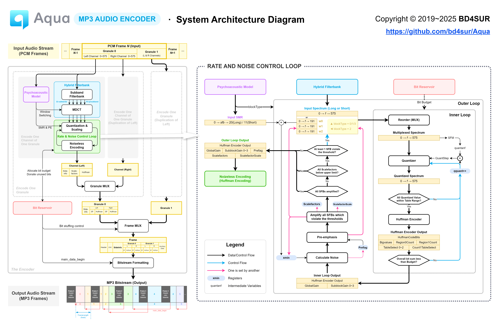
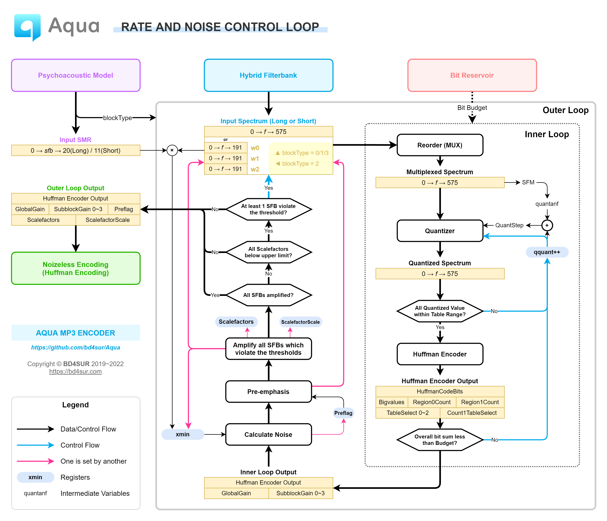

------

Experimental MPEG-1 Audio Layer 3 (MP3) encoder. Implemented according to ISO/IEC 11172-3 and its reference code "dist10" for personal research. No decoder included in this repo.

**WARNING: USE AT YOUR OWN RISK! DO NOT USE THIS ENCODER FOR FORMAL PURPOSES! (e.g. archiving, broadcasting, etc.)**

实验性 MPEG-1 Audio Layer 3 (MP3) 音频编码器。依据 ISO/IEC 11172-3 及其配套的参考代码“dist10”实现，用于个人学习研究。本系统不含解码器。

**警示：风险自负！请勿将本编码器用于正式目的，例如存档、广播等。**

**▶ [在线体验 Online Demo](https://bd4sur.com/Aqua/index.html)**

## 特性

- 目前实现的特性：采样率32kHz/44.1kHz/48kHz，恒定码率64/128/224/320kbps。
- 计划开发的特性：第二心理声学模型、联合立体声。
- 暂不实现的特性：混合块、尺度因子预测（即scfsi）、低采样率支持、VBR、ID3标签、回放增益等等。
- 可视化工具：[分析子带滤波器组](https://bd4sur.com/Aqua/demo/Filterbank.html)

## 使用方法

- 可视化用户界面：下载仓库，直接在浏览器中打开`index.html`即可。
- 控制台命令：执行`node aqua.js`，用于批量编码。待完善。
- 构建：`npx tsc`

## 研究笔记

## 研究开发进度

- 2019-11-01：开始资料调研
- 2019-11-09：实现WAV解析原型
- 2019-11-14：实现简单低通滤波（支线工作）
- 2019-11-16：初步实现分析子带滤波器
- 2019-11-21：研究并尝试实现第二心理声学模型
- 2019-11-23：分析子带滤波器可视化
- 2019-11-27：开始开发MDCT和长块去混叠
- 2019-11-29：开始开发内/外层循环和哈夫曼编解码
- 2019-12-04：切换新仓库，完善版本控制
- 2019-12-24：实现比特储备机制
- 2020-01-05：实现比特流组装
- 2020-01-07：输出第一个格式正确的MP3文件
- **2020-01-15**：首次成功编码若干个完整的音乐文件
- 2020-01-19：项目取名“Aquarius”并设计图标
- 2020-05-23：项目更名“Aqua”
- 2020-05-28：固化首个基线版本（V0.1）
- **2022-07-08**：首次实现端到端的基于本编码器和GNURadio的无线MP3音频传输
- 待办：彻底的性能优化，使编码器实现真正的实时编码（最高优先级）
- 待办：优化`quantanf`量化步长初始值设置算法
- 待办：实现第二心理声学模型和高频预加重
- 待办：完善文档和笔记；处理掉所有TODO

## 权利声明

版权所有 © 2019~2023 BD4SUR，保留所有权利。

本系统“按原样”提供，采用MIT协议授权。本系统为作者个人以学习和自用目的所创作的作品。作者不对本系统的质量作任何承诺。作者不保证提供有关本系统的任何形式的解释、维护或支持。作者不为任何人使用此系统所造成的任何正面的或负面的后果负责。

**第三方组件**

- [jQuery](https://jquery.com/)
- [FileSaver.js](https://github.com/eligrey/FileSaver.js)
