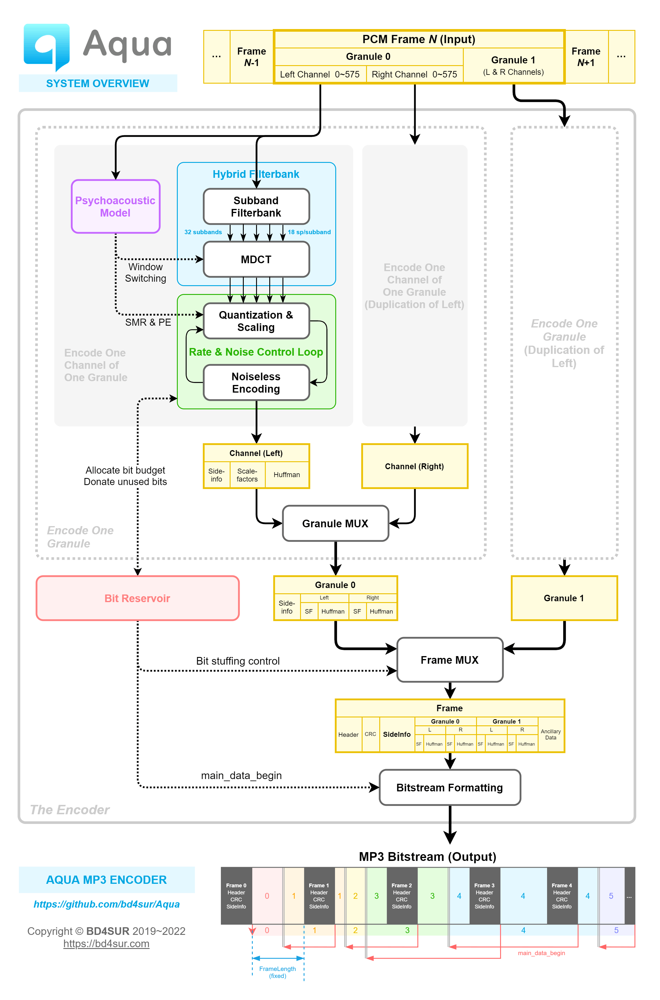

<p align="center"></p>

------

An experimental MP3 encoder. **DO NOT USE THIS ENCODER FOR SERIOUS PURPOSES! (e.g. archiving, broadcasting, etc.)**

实验性 MPEG-1 Audio Layer 3 (MP3) 音频编码器。依据 ISO/IEC 11172-3 及其配套的示例代码“dist10”实现，用于MP3编码算法学习、验证。本系统不含解码器。

**警示：本编码器仅供作者个人学习研究，并不成熟可靠，请勿用于严肃的音频编码任务，如音频存档、正式广播等。请务必使用ffmpeg、LAME等成熟的编码器。**

**▶ [可视化交互原型](https://bd4sur.com/Aqua/index.html)**

## 特性规划

计划开发的特性：第二心理声学模型、联合立体声。

暂不实现的特性：混合块、尺度因子预测（即scfsi）、低采样率支持（MPEG-2标准）、VBR（非标准）、ID3标签（非标准）、回放增益（非标准）等等。

## 开发进度

- 2019-11-01：开始资料调研
- 2019-11-09：实现WAV解析原型
- 2019-11-14：实现简单低通滤波（支线工作）
- 2019-11-16：初步实现分析子带滤波器
- 2019-11-21：研究并尝试实现第二心理声学模型
- 2019-11-23：分析子带滤波器可视化
- 2019-11-27：开始开发MDCT和长块去混叠
- 2019-11-29：开始开发内/外层循环和哈夫曼编解码
- 2019-12-04：切换新仓库，完善版本控制
- 2019-12-24：实现比特储备机制
- 2020-01-05：实现比特流组装
- 2020-01-07：输出第一个格式正确的MP3文件
- **2020-01-15**：首次成功编码若干个完整的音乐文件
- 2020-01-19：项目取名“Aquarius”并设计图标
- 2020-05-23：项目更名“Aqua”
- 2020-05-28：固化首个基线版本（V0.1）
- **2022-07-08**：首次实现端到端的基于本编码器和GNURadio的无线MP3音频传输
- 待办：彻底的性能优化，使编码器实现真正的实时编码（最高优先级）
- 待办：优化`quantanf`量化步长初始值设置算法
- 待办：实现第二心理声学模型和高频预加重
- 待办：完善文档和笔记；处理掉所有TODO

## 构建、运行

GR音频PCM源 → GR浮点PCM编码为PDU → GR_TCP_Client

Aqua_TCP_Server → MP3_Encoder → stdout → lame解码 → aplay播放

Aqua_TCP_Server → MP3_Encoder → Aqua_TCP_Client

GR_TCP_Server → GR_QPSK_Transmitter

GR_QPSK_Reveiver → FIFO/Pipe → lame解码 → aplay播放

```
npx tsc
node aqua.js | lame --decode --mp3input - - | aplay -
```

## 可视化

- [分析子带滤波器组](https://bd4sur.com/Aqua/demo/Filterbank.html)

## 研究笔记




## 权利声明

版权所有 © 2019~2022 BD4SUR，保留所有权利。

采用MIT协议授权。

本系统为个人以学习和自用目的所创作的作品。作者不对此系统的质量作任何承诺，不保证提供任何形式的解释、维护或支持，也不为任何人使用此系统所造成的任何正面的或负面的后果负责。

**第三方组件**

- [jQuery](https://jquery.com/)
- [FileSaver.js](https://github.com/eligrey/FileSaver.js)
