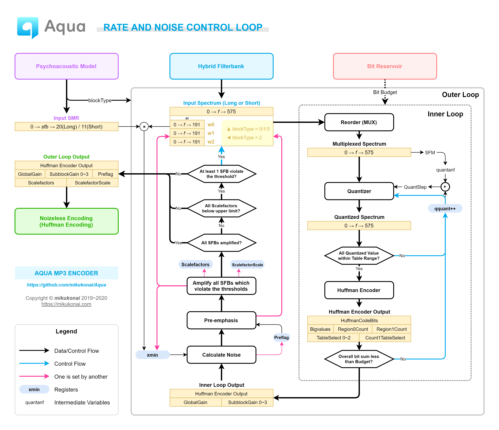

<h1 align="center">Aquarius MP3 Encoder</h1>

## 介绍

MP3编码器学习、研究、开发项目。目标是实现可用的 MPEG-1 Audio Layer 3 (MP3) 音频编码器。

## 研发进度

目前已实现的特性：

- 基本的变换编码—熵编码流程框架（高码率下已经可用）

正在开发的特性：

- 噪声控制循环的预加重环节
- 第二心理声学模型
- 编码过程可视化

暂缓实现的特性如下：

- 联合立体声
- 混合块
- 尺度因子预测（即scfsi）
- VBR
- ID3标签
- 回放增益

|日期|进展|
|:----|:----|
|2019.11.01|确立“三大攻坚战”目标[注1]，项目启动，开始资料调研工作|
|2019.11.07|建立仓库“Otonashi”|
|2019.11.09|实现WAV解析、播放和频谱显示|
|2019.11.14|实现低通滤波（支线工作）|
|2019.11.16|初步实现分析子带滤波器|
|2019.11.21|开始开发第二心理声学模型|
|2019.11.23|分析子带滤波器可视化|
|2019.11.27|实现MDCT和长块去混叠|
|2019.11.29|开始开发内/外层循环和哈夫曼编解码|
|2019.12.04|切换到新仓库，并更名为“MP3-Study”|
|2019.12.24|实现比特储备机制|
|2020.01.05|实现比特流组装|
|2020.01.07|输出第一个合式MP3文件|
|**2020.01.15**|修正若干重大错误，尝试编码若干个完整的音乐文件，效果不错|
|2020.01.19|项目定名“Aquarius”并设计图标|
|进行中|实现第二心理声学模型|
|进行中|实现外层循环的预加重环节|
|进行中|给项目起个好听的名字（|
|进行中|完善项目文档|
|进行中|进一步测试，尽可能排除所有已知故障，处理掉所有TODO|
|进行中|完成以上工作后，发布第一个基线版本（V0.1.0）|

- [注1] “三大攻坚战”指 ①实现图像编解码器（原理验证原型）；②实现完整、可用的MP3编码器；③深入理解H.264视频编解码标准和原理，并基于①的成果，实现若干原理验证原型。
- [注2] 加粗的日期是里程碑。

## 研发方针

- 直接实现 Layer 3（即MP3）和第二心理声学模型。忽略可选的、不重要的特性。
- 实现驱动的研究：先实现原理验证原型，再深入研究理论和原理。
- 代码即文档。
- 不制定计划，但是要做好过程记录。
- 做好打持久战的心理准备，戒骄戒躁。

## 可视化

- [MDCT所使用的4种窗口及其转换](https://mikukonai.com/MP3-Study/demo/MDCT-windows.html)
- [低通滤波](https://mikukonai.com/MP3-Study/demo/LPF.html)（支线任务）
- [分析子带滤波器组](https://mikukonai.com/MP3-Study/demo/Filterbank.html)

## 研究笔记

- [分析子带滤波器组](./documentation/分析子带滤波器组.md)
- [心理声学模型](./documentation/心理声学模型.md)
- [发表在博客上的研究笔记](https://mikukonai.com/#/wiki/MP3%E7%BC%96%E8%A7%A3%E7%A0%81%E5%8E%9F%E7%90%86)

## 调试记录

这里记录一些比较棘手的问题。

|问题|原因分析|解决方案|
|:--|:--|:--|
|编码后的声音有不合理的失真。具体现象是钢琴等乐器的声音呈现水钟样声音，等等，声谱图上可见某些谱线缺失或多余。|此问题并非量化失真，考虑是混合子带滤波有问题。|将现有代码逐行与dist10比对，发现dist10对分析子带滤波器的结果做了乘以-1的后处理。原因在于分析子带滤波的输入是反向的，需要对其输出作处理，才能得到正确的结果。目前不清楚这个性质的依据是什么。|
|码流有同步错误，EncSpot显示的帧数少于实际帧数。|比特流组装时，每个granule的每个声道都有各自独立的`part23length`，需要分别stuffing，然后组装成一整个maindata。|改为分别stuffing。|
|短块编码有误。|part2长度计算有误，导致短块的比特流组装有误。|改进part2长度计算。|
|静音granule（指频谱全为0的granule）出现很大的超限。|因静音帧经过内层循环后得到的`globalGain`为210（因为SFM=1并且量化步数=0），这是一个很大的增益。|判断哈夫曼编码串的长度是否为0，如果是0，则将`globalGain`设为0。（此为权宜之计，按照IS推荐流程，静音granule其实根本不需要走量化循环）|

